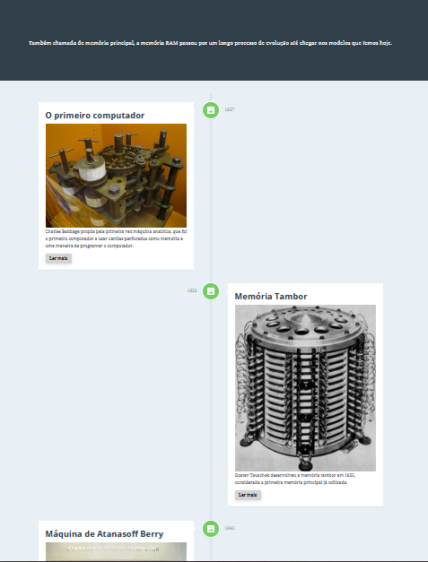

# ram_timeline.github.io
Página que será adicionada no centro de memórias da FATEC

link da página
https://erick-js.github.io/ram_timeline/

# Imagem da página

# Responsive Vertical Timeline

An easy to customize, responsive timeline.

[Article on CodyHouse](https://codyhouse.co/gem/vertical-timeline)

[Demo](https://codyhouse.co/demo/vertical-timeline)
 
[License](https://codyhouse.co/license)

⚠️ A new version of this Experiment is available in our [Components Library](https://codyhouse.co/ds/components/app/vertical-timeline).

## Dependencies

This experiment is built upon the [CodyHouse Framework](https://github.com/CodyHouse/codyhouse-framework).

## Credits

Icons: [Nucleo Library](https://nucleoapp.com/)
